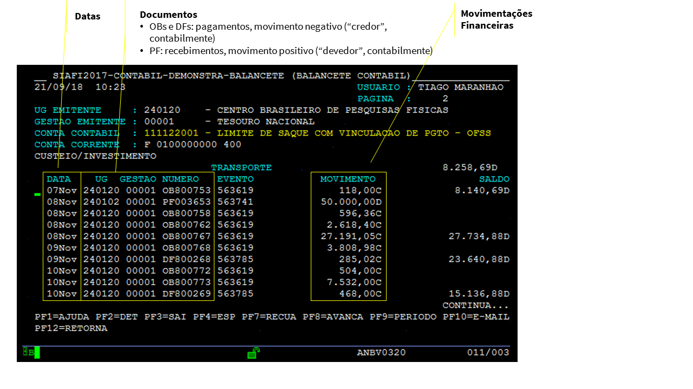
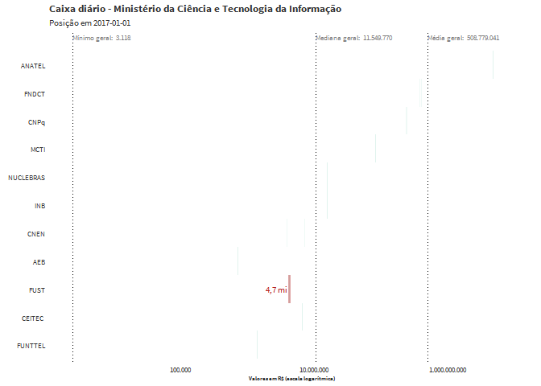
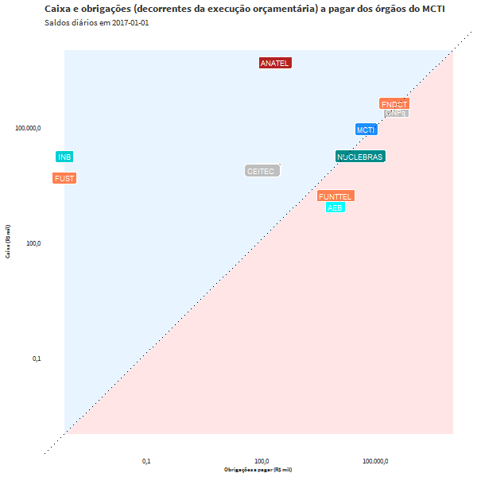

```{css, echo=FALSE}

body {
  font-family: "Source Sans Pro";
}

.shiny-table {
  font-size: 10pt;
}

.dygraph-legend, .dygraph-axis-label {
  font-family: "Source Sans Pro";
}

.dygraph-label {
  font-family: "Source Sans Pro";
}

.dygraph-ylabel {
  font-size: 12px;
}

h1, h2,h3,h4 {
  color: #004a93;
}

h1, h2 {
  font-weight: bold;
  font-family: 'Josefin Sans', sans-serif;
}

blockquote {
  font-size: 12px;
  background-color: #edeff9; 
}

```

<style>
@import url('https://fonts.googleapis.com/css?family=Oswald');
@import url('https://fonts.googleapis.com/css?family=Josefin+Sans');
</style>

```{r message=FALSE, warning=FALSE}
library(tidyverse)
library(readxl)
library(extrafont)
library(kableExtra)
library(lubridate)
#library(gganimate)
library(scales)
library(ggrepel)
library(xts)
library(dygraphs)
library(formattable)
loadfonts()

tema <- function(){
    theme_minimal() +
    theme(
      text = element_text(family = "Source Sans Pro", colour = "grey20"),
      axis.text = element_text(family = "Source Sans Pro", colour = "grey20"),
      title = element_text(face = "bold"), # size para o Shiny
      plot.subtitle = element_text(face = "plain", size = 9),
      plot.caption = element_text(face = "italic"),
      panel.grid.major = element_blank(), 
      panel.grid.minor = element_blank(),
      legend.text = element_text(size = 8),
      legend.title = element_text(size = 8),
      axis.ticks.x = element_line(),
      axis.title = element_text(size = 7),
      legend.position = 'bottom')
}

# rsconnect::deployApp('C:/Users/tiago.pereira/GitHub/puddles-puddles/puddles_MCTI.Rmd')
```
## Motivação: I see dead puddles


Esta análise preliminar e experimental busca explorar e visualizar os chamados *empoçamentos*: a permanência de saldos financeiros não utilizados em algumas unidades, dificultando os processos de programação financeira e execução orçamentária no âmbito do Governo Federal. Esperamos assim compreender o motivo da existência desses empoçamentos.

Para isso, faremos uma análise contemplando todas as movimentações financeiras dos órgãos do Ministério da Ciência e Tecnologia da Informação. Inicialmente analisaremos essas movimentações consolidadas por dia. No final deste documento, analisaremos as movimentações por tipo (pagamentos, transferências, recebimentos etc.) e por dia, mas para apenas um dos órgãos, o órgão 24000, que representa a administração direta do Ministério.

## Análise geral dos órgão do MCTI

### Os dados

Os dados que foram extraídos do Siafi representam as variações diárias no caixa e no total de obrigações a pagar de cada órgão. As obrigações a pagar consideradas são aquelas assumidas em decorrência da execução orçamentária.

As contas contábeis que representam essas informações são as seguintes:

**Caixa**
11112.20.01 = LIMITE DE SAQUE COM VINCULACAO DE PGTO - OFSS

**Obrigações a Pagar**
62292.01.03 = EMPENHOS LIQUIDADOS A PAGAR
62292.01.07 = EMPENHOS LIQUIDADOS A PAGAR INSCRITO EM RPP
63130.00.00 = RP NAO PROCESSADOS LIQUIDADOS A PAGAR
63210.00.00 = RP PROCESSADOS A PAGAR


Essas contas recebem lançamentos por meio da emissão de documentos contábeis no Siafi. A tela abaixo mostra um exemplo de movimentação em uma das unidades do órgão 24000 (MCTI).



Na extração dos dados do Siafi, os valores estão consolidados por dia, por órgão e por informação (Caixa ou Obrigações). Mas observe-se que seria possível analisar os dados considerando ainda os níveis de documento (o que faremos na [seção final deste documento](#final)), unidade gestora, fonte de recursos e vinculação de pagamento (classificadores típicos da programação financeira).

A tabela abaixo apresenta uma amostra dos dados extraídos do Siafi que serão utilizados.

```{r message=FALSE, warning=FALSE}

dados_Siafi <- read_excel("data/MCTI_lim_saque_liq_pagar.xlsx", skip = 5)

colnames(dados_Siafi) <- c(
  "codOrgao", 
  "nomeOrgao", 
  "Data", 
  "Item", 
  "Movimento")

# criar uma tabelinha com os códigos e nomes dos órgãos para posteriormente levar essas informações à tabela processada

nomes_orgaos <- read.csv2("orgaosMCTI.csv")
nomes_orgaos$codOrgao <- as.character(nomes_orgaos$codOrgao)

# mostrar a tabela do Siafi

formattable(tail(dados_Siafi, 10))
```

Vamos tratar os dados para obter uma matriz com os saldos diários do caixa, das obrigações a pagar e do saldo líquido (a diferença entre o caixa e as obrigações a pagar) para todo o período considerado, por órgão do MCTI.

```{r message=FALSE, warning=FALSE}

dados <- dados_Siafi %>%
  filter(!(codOrgao %in% c("49280", "20502"))) %>% # (1)
  mutate(Date     = if_else(str_sub(Data, 1, 4) == "000/", 
                            as.Date(paste0(str_sub(Data, 5, 8),"-01-01")),
                            dmy(Data))) %>%
  group_by(Date, codOrgao, Item) %>% 
  summarise(Movimento = sum(Movimento)) %>% # (1a)
  ungroup() %>% # (1b)
  unite(classificador, Item, codOrgao, sep = "__") %>% # (2)
  select(Date, classificador, Movimento) %>%
  spread(key = classificador, value = Movimento, fill = 0) %>% # (2b)
  complete(Date = seq(min(Date), max(Date), by = "days")) %>% # (3)
  replace(is.na(.), 0) %>% # (3a)
  mutate_at(-1, funs(cumsum(.))) %>% # (4)
  mutate(data_num = factor(paste0(year(Date), # (5)
                                  str_sub(Date, 6, 7), 
                                  str_sub(Date, 9, 10)))) %>%
  gather(c(-"data_num", -"Date"), key = classificador, value = saldo) %>% # (6)
  separate(classificador, c("item", "codOrgao"), sep = "__") %>%
  spread(key = item, value = saldo, fill = 0) %>%
  rename(Caixa      = `LIMITES DE SAQUE (OFSS, DIVIDA, BACEN E PREV)`,
         Obrigacoes = `VALORES LIQUIDADOS A PAGAR (EXERCICIO + RP)`) %>%
  mutate(Saldo      = Caixa - Obrigacoes)
         
# (1) filtrando valor indevido registrado nos correios e em outro órgão (que são não OFSS).

# (1a) esse group_by com summarise é para somar eventuais registros repetidos. Ou seja, preciso ficar com um movimento para cada dia, para cada orgao. como atribuí que o saldo de abertura seria um movimento no dia 01/01, e tinha um caso em que havia de fato movimento no dia 01/01 em um orgao, apareciam dois registros no dia 01/01 nesse orgao. o summarise elimina esse problema.

# (1b) por um motivo que ainda não entendo, sem esse ungroup ele não calcula o cumsum corretamente.

# (2) unindo os dois classificadores (item e orgao) para poder fazer um spread só, depois vou separá-los.

# (2b) com o spread, um orgao que eventualmente não possuía movimento em determinado dia vai aparecer com "NA". Preenchi com 0 pq depois vou usar o cumsum para calcular os saldos.

# (3) o complete vai completar as datas faltantes considerando a sequencia de dias entre o menor e o maior dia presente nos dados. Os valores para esses dias faltantes serão completados com "NA", então...

# (3a) uso o replace para substituir esses NAs por 0.

# (4) agora uso o cumsum para calcular os totais acumulados em cada coluna (que neste ponto se referem a cada órgão.) usei o -1 na referência do mutate_at para calcular essa soma acumulada para TODAS as colunas, EXCETO a primeira (pq ela é a data).
  
# (5) preciso dessa data nesse formato para fazer a animação.

# (6) agora, de maneira semelhante, uso o "-" para dizer que quero empilhar todas as colunas, exceto as colunas de data numeria e de data.
```

Ficamos então com um conjunto de dados com o seguinte formato:

```{r message=FALSE, warning=FALSE}
head(dados)
write.csv2(dados, "dados.csv")
```

Esses dados podem ser baixados clicando-se [aqui](dados.csv).

Em seguida, vamos calcular alguns sumários estatísticos (mínimos, máximos, médias e medianas) por órgão, para todo o período, e vamos terminar de preparar os dados para começar a visualizá-los.

```{r message=FALSE, warning=FALSE}
# elaborar sumários para gráficos (e para ordenar os órgãos por média descrescente)

sumario_dados <- dados %>%
  group_by(codOrgao) %>%
  summarise(minimo      = min(Caixa, na.rm = TRUE),
            data_min    = Date[which.min(Caixa)],
            maximo      = max(Caixa, na.rm = TRUE),
            data_max    = Date[which.max(Caixa)],
            mediana     = median(Caixa, na.rm = TRUE),
            media       = mean(Caixa),
            media_obrig = mean(Obrigacoes)) %>%
  ungroup() %>%
  arrange(desc(media)) %>%
  left_join(nomes_orgaos) %>% 
  mutate(codOrgao   = fct_reorder(codOrgao, media, desc = TRUE), # (1)
         nomeOrgao  = fct_reorder(nomeOrgao, media, desc = TRUE),
         siglaOrgao = fct_reorder(siglaOrgao, media, desc = TRUE),
         Orgao      = paste(codOrgao, nomeOrgao, sep = " - "))

sumario_barplot <- sumario_dados %>%
  select(codOrgao, nomeOrgao, siglaOrgao, Orgao, media, media_obrig) %>%
  gather(c(media, media_obrig), key = variavel, value = valor) %>%
  mutate(variavel = factor(variavel, levels = c("media_obrig", "media"))) # (2)

# (1) só para mudar a ordem das barras no plot logo abaixo.
  
dados <- dados %>%
  left_join(sumario_dados)

# (2) tem um jeito melhor de ordenar vários factors pelo mesmo critério? talvez com purr::map()...

cores <- RColorBrewer::brewer.pal(3, "Set2")
nomes_series <- c("Caixa", "Obrigacoes", "Saldo")
names(cores) <- nomes_series

```

### Uma visão geral: médias para o período

O gráfico abaixo demonstra as médias dos saldos diários da conta de limite de saque (que representa a parcela da Conta Única da União atribuida ao órgão) dos órgãos do MCTI no período considerado.

```{r message=FALSE, warning=FALSE, fig.height=6}

cores_barras <- c("media_obrig" = cores[["Obrigacoes"]], "media" = cores[["Caixa"]])

graf_barras <- function(dados_plot, complemento_titulo) {
  ggplot(dados_plot, aes(y = valor, x = siglaOrgao, fill = variavel)) +
    geom_bar(stat = "identity", color = "white", position = "dodge") +
    geom_text(aes(y = valor + 2000, label = paste(format(round(valor/1000000,0), 
                                  big.mark = ".", decimal.mark = ","), "mi"),
                  color = variavel),
              size = 3, 
              hjust = 0,
              position = position_dodge(1), # (0)
              family = "Source Sans Pro") +
    coord_flip() +
    scale_color_manual(values = cores_barras) +
    scale_fill_manual(values = cores_barras,
                      labels = c("media_obrig" = "Obrigações", "media" = "Caixa")) +
    scale_y_continuous(labels = function(x) {format(x/1000000, big.mark = ".", decimal.mark=",", scientific = FALSE)}) +
    labs(y = "Valores em milhões de R$",
         x = NULL,
         fill = NULL,
         title = paste0("Média dos saldos financeiros diários - caixa x obrigações - ", complemento_titulo),
         subtitle = "Período de janeiro de 2017 a agosto de 2018") +
    expand_limits(y = max(sumario_dados$valor) * 1.05) +
    tema() + guides(color = FALSE) # (1)
  
  # (0) precisa passar um "width" para a position_dodge para posicionar o label corretamente.
  # (1) para não mostrar a legenda apenas para o color (que foi usado no geom_text)
}

graf_barras(sumario_barplot, "órgãos do MCTI")
```

Como se vê, a Anatel apresenta valores muito superiores aos dos demais órgãos. Refazendo o gráfico para os demais órgãos.

```{r message=FALSE, warning=FALSE, fig.height = 6}
graf_barras(sumario_barplot %>% filter(codOrgao != "41231"), "órgãos do MCTI (exceto ANATEL)")
```

### Saldos diários dos caixas dos órgãos

O gráfico acima demonstra a média, mas para ter uma melhor ideia da distribuição desses valores no período, elaboramos o gráfico abaixo com todos os saldos diários de cada órgão do MCTI plotados. O valor do caixa para cada dia é representado por uma linha clara. Concentrações de saldos numa mesma faixa de valores produzem regiões mais escuras. O gráfico utiliza uma escala logarítmica, para permitir uma melhor visualização de todos os órgãos, em razão da grande diferença entre a magnitude dos saldos observados em cada órgão.

```{r message=FALSE, warning=FALSE}

qde_orgaos <- length(unique(dados$Orgao))

graf_estatico <- ggplot(dados, aes(y = Caixa, x = siglaOrgao)) +
  geom_tile(aes(y = round(Caixa,0)), fill = cores["Caixa"], alpha = 0.1, width = 1, height = 0.01) +
  coord_flip() +
  geom_hline(yintercept = min(dados$Caixa), linetype = "dotted") +
  geom_hline(yintercept = mean(dados$Caixa), linetype = "dotted") +
  geom_hline(yintercept = median(dados$Caixa), linetype = "dotted") +
  annotate(geom = "text", x = qde_orgaos + 1, y = min(dados$Caixa), 
           label = paste("Mínimo geral: ", 
                         format(round(min(dados$Caixa),0), 
                                big.mark = ".", decimal.mark = ",")),
           color = "grey50", size = 3, hjust = 0,
           family = "Source Sans Pro") +
  annotate(geom = "text", x = qde_orgaos + 1, y = mean(dados$Caixa), 
           label = paste("Média geral: ", 
                         format(round(mean(dados$Caixa),0), 
                                big.mark = ".", decimal.mark = ",")),
           color = "grey50", size = 3, hjust = 0,
           family = "Source Sans Pro") +
  annotate(geom = "text", x = qde_orgaos + 1, y = median(dados$Caixa), 
           label = paste("Mediana geral: ", 
                         format(round(median(dados$Caixa),0), 
                                big.mark = ".", decimal.mark = ",")),
           color = "grey50", size = 3, hjust = 0,
           family = "Source Sans Pro") +
  scale_y_log10(labels = function(x) {format(x, big.mark = ".", decimal.mark=",", scientific = FALSE)}) +
  labs(y = "Valores em R$ (escala logarítmica)",
       x = NULL,
       title = "Caixa diário - Órgãos do MCTI",
       subtitle = "Período de janeiro de 2017 a agosto de 2018") +
  expand_limits(y = max(dados$Saldo) * 2, x = qde_orgaos + 1.2) + 
  tema() + theme(legend.position = "none")

graf_estatico
```

O mesmo gráfico, porém com a inclusão de diagramas de caixas, indicando medianas, quartis, mínimos, máximos e outliers.

```{r message=FALSE, warning=FALSE}
graf_estatico + geom_boxplot(color = "darkgrey")
```

Por fim, uma animação que mostra a evolução dos valores diários no tempo, com a indicação dos valores mínimos (em <span style="color: firebrick;">vermelho</span>) e máximos <span style="color: navy;">azul</span>.



```{r message=FALSE, warning=FALSE}
# graf_gif <- graf_estatico +
#   geom_tile(aes(y = ifelse(Date>data_min, minimo,NA)), fill = "firebrick", alpha = 0.4, width = 1, height = 0.03) +
#   geom_tile(aes(y = ifelse(Date>data_max, maximo,NA)), fill = "navy", alpha = 0.4, width = 1, height = 0.03) +  
#   geom_text(aes(y = ifelse(Date>data_min, minimo * 0.95,NA), 
#                 label = paste(format(round(minimo/1000000,1), big.mark = ".", decimal.mark=",", scientific = FALSE), "mi")), 
#             hjust = 1,
#             size = 4, 
#             family = "Source Sans Pro",
#             fontface = "plain",
#             color = "firebrick"
#             ) +
#   geom_text(aes(y = ifelse(Date>data_max, maximo * 1.05,NA), 
#                 label = paste(format(round(maximo/1000000,1), big.mark = ".", decimal.mark=",", scientific = FALSE), "mi")), 
#             hjust = 0,
#             size = 4, 
#             family = "Source Sans Pro",
#             fontface = "plain",
#             color = "navy"
#             ) +
#   labs(subtitle = "Posição em {frame_time}") +
#   tema() + theme(legend.position = "none") +
#   transition_time(Date) +
#   ease_aes('linear')

# animate(graf_gif, nframes = 200, height = 480, width = 672)

# anim_save("caixa_diario.gif", animation = last_animation())
```

## Análise do caixa em relação às obrigações a pagar

### Evolução no período considerado

```{r}
triangulo_superior <- data.frame("x" = c(1, 1e+10, 1),
                                 "y" = c(1, 1e+10, 1e+10))

triangulo_inferior <- data.frame("x" = c(1, 1e+10, 1e+10),
                                 "y" = c(1, 1e+10, 1))
```

Vamos visualizar a evolução da situação de cada órgão em relação às suas obrigações e disponibilidades financeiras ao longo do tempo. Primeiramente, vamos considerar a posição para um dia específico. 

(explicar melhor)

```{r}
ggplot(dados %>% filter(Date == "2017-01-02"),
       aes(y = Caixa, 
           x = ifelse(Obrigacoes <= 0, 1, Obrigacoes))) + # color = Caixa > Obrigacoes
  geom_polygon(data = triangulo_superior, 
               aes(x = x, y = y),
               fill = "dodgerblue",
               alpha = 0.1) +
  geom_polygon(data = triangulo_inferior, 
               aes(x = x, y = y),
               fill = "red",
               alpha = 0.1) +
  geom_label(aes(fill = siglaOrgao, label = siglaOrgao), color = "white", size = 3) +
  geom_abline(intercept = 0, slope = 1, linetype="dotted") +
  scale_x_log10(limits=c(1, 1e+10), 
                labels = function(x) {format(x/1000, big.mark = ".", decimal.mark=",", scientific = FALSE)}) +
  scale_y_log10(limits=c(1, 1e+10),
                labels = function(x) {format(x/1000, big.mark = ".", decimal.mark=",", scientific = FALSE)}) +
  scale_fill_manual(values = c("AEB" = "cyan", 
                               "MCTI" = "dodgerblue",
                               "SPOA" = "dodgerblue",
                               "ANATEL" = "firebrick", 
                               "NUCLEBRAS" = "darkcyan",
                               "INB" = "darkturquoise",
                               "INPE" = "gray",
                               "FINTEL" = "coral",
                               "FUST" = "coral",
                               "FUNTTEL" = "coral",
                               "FNDCT" = "coral",
                               "CTI" = "gray",
                               "CEITEC " = "gray",
                               "CNPq" = "gray",
                               "CNEN" = "darkgray",
                               "CNTEA" = "lightslategray")) +
  labs(y = "Caixa (R$ mil, log)",
       x = "Obrigações a pagar (R$ mil, log)",
       title = "Caixa e obrigações a pagar dos órgãos do MCTI",
       subtitle = "Saldos no dia 2017-01-02") +
  tema() + theme(legend.position = "none")
```

Agora a evolução no período



```{r message=FALSE, warning=FALSE}

# scat <- ggplot(dados,
#        aes(y = Caixa, 
#            x = ifelse(Obrigacoes <= 0, 1, Obrigacoes))) + # color = Caixa > Obrigacoes
#   geom_polygon(data = triangulo_superior, 
#                aes(x = x, y = y),
#                fill = "dodgerblue",
#                alpha = 0.1) +
#   geom_polygon(data = triangulo_inferior, 
#                aes(x = x,
#                    y = y),
#                fill = "red",
#                alpha = 0.1) +
#   geom_label(aes(fill = siglaOrgao, label = siglaOrgao), color = "white", size = 3) +
#   geom_abline(intercept = 0, slope = 1, linetype="dotted") +
#   scale_x_log10(limits=c(1,1e+10), 
#                 labels = function(x) {format(x/1000, big.mark = ".", decimal.mark=",", scientific = FALSE)}) +
#   scale_y_log10(limits=c(1,1e+10),
#                 labels = function(x) {format(x/1000, big.mark = ".", decimal.mark=",", scientific = FALSE)}) +
#   scale_fill_manual(values = c("AEB" = "cyan", 
#                                "MCTI" = "dodgerblue",
#                                "SPOA" = "dodgerblue",
#                                "ANATEL" = "firebrick", 
#                                "NUCLEBRAS" = "darkcyan",
#                                "INB" = "darkturquoise",
#                                "INPE" = "gray",
#                                "FINTEL" = "coral",
#                                "FUST" = "coral",
#                                "FUNTTEL" = "coral",
#                                "FNDCT" = "coral",
#                                "CTI" = "gray",
#                                "CEITEC " = "gray",
#                                "CNPq" = "gray",
#                                "CNEN" = "darkgray",
#                                "CNTEA" = "lightslategray")) +
#   labs(y = "Caixa (R$ mil)",
#        x = "Obrigações a pagar (R$ mil)",
#        title = "Caixa e obrigações (decorrentes da execução orçamentária) a pagar dos órgãos do MCTI",
#        subtitle = "Saldos diários em {frame_time}") +
#   tema() + theme(legend.position = "none") +
#   transition_time(Date) +
#   ease_aes('linear')

#animate(scat, nframes = 500, height = 600, width = 600)

#anim_save("scat2.gif", animation = last_animation())

```

### Sumarizando os trajetos dos órgãos no diagrama

Para mostrar a trajetória (e ilustrar a frequência de permanência em cada zona de saldos positivos ou negativos)...

Para um único órgão

```{r}

plot_connected_scatterplot <- function(dados){
  ggplot(dados,
       aes(y = Caixa, 
           x = ifelse(Obrigacoes <= 0, 1, Obrigacoes))) + # color = Caixa > Obrigacoes
    geom_polygon(data = triangulo_superior, 
                 aes(x = x, 
                     y = y),
                 fill = "dodgerblue",
                 alpha = 0.1) +
    geom_polygon(data = triangulo_inferior, 
                 aes(x = x, 
                     y = y),
                 fill = "red",
                 alpha = 0.1) +
    geom_path(color = "gray") +
    geom_point(aes(color = Caixa > Obrigacoes), alpha = 0.7) +
    geom_abline(intercept = 0, slope = 1, linetype="dotted") +
    scale_x_log10(limits=c(1,1e+10),
                  labels = function(x) {format(x/1000, big.mark = ".", decimal.mark=",", scientific = FALSE)}) +
    scale_y_log10(limits=c(1,1e+10),
                  labels = function(x) {format(x/1000, big.mark = ".", decimal.mark=",", scientific = FALSE)}) +
    scale_color_manual(values = c("TRUE" = "dodgerblue", "FALSE" = "red"),
                       guide = FALSE) +
    labs(y = "Caixa (R$ mil)",
         x = "Obrigações a pagar (R$ mil)",
         title = "Caixa x Obrigações a pagar",
         subtitle = "Eixos em escala logarítmica") +
    tema()
}

plot_connected_scatterplot(dados %>% filter(codOrgao == "24000")) + labs(subtitle = "Órgão 24000 - MCTI (Administração Direta)")
```

E para todos os órgãos?

```{r message=FALSE, warning=FALSE, fig.height = 8, fig.width = 7}
plot_connected_scatterplot(dados) + facet_wrap(~ siglaOrgao, ncol = 3)
```

### Visualizando órgão a órgão

```{r prep-shiny, message=FALSE, warning=FALSE}
lista_orgaos <- unique(as.character(dados$siglaOrgao))

gera_xts <- function(orgao) {
  dados_xts <- dados %>% 
        filter(siglaOrgao == orgao) %>%
        select(Date, Caixa, Obrigacoes, Saldo) %>%
        mutate_at(-1, funs(./1000000))
  sh_xts <- xts(dados_xts[,-1], order.by = dados_xts$Date)
}

lista_xts <- lapply(lista_orgaos, gera_xts)
names(lista_xts) <- lista_orgaos


# gerar um total
xts_total <- lista_xts[[1]]
for (i in 2:length(lista_xts)) {
  xts_total <- xts_total + lista_xts[[i]]
}

# um total sem Aanatel
xts_total_semAnatel <- xts_total - lista_xts[["41231"]]

# incorporando esses totais
lista_xts[[length(lista_xts)+1]] <- xts_total_semAnatel
lista_xts[[length(lista_xts)+1]] <- xts_total

lista_orgaos <- c(lista_orgaos, "Total sem Anatel", "Total")
names(lista_xts) <- lista_orgaos
```

```{r shiny, message=FALSE, warning=FALSE}
inputPanel(
  selectInput("orgao", label = "Órgão do MCTI:",
              choices = lista_orgaos, selected = lista_orgaos[1]),
  radioButtons("periodicidade", label = "Periodicidade", 
               choiceNames = c("Diários", "Semanais", "Mensais"),
               choiceValues = c("days", "weeks", "months"),
               selected = "days"),
  checkboxGroupInput("variavel", label = "Série", 
                     choiceNames  = c("Caixa", "Obrigações", "Saldo"),
                     choiceValues = c("Caixa", "Obrigacoes", "Saldo"),
                     selected     = c("Caixa", "Obrigacoes", "Saldo"))
)

renderDygraph({
  
  xts_selecionado <- lista_xts[[input$orgao]][endpoints(lista_xts[[input$orgao]], on = input$periodicidade), # (1)
                                              input$variavel]
  
  # xts_selecionado <- lista_xts[[input$orgao]]
  
  dygraph(xts_selecionado) %>%
      dyOptions(colors = RColorBrewer::brewer.pal(3, "Set2"),
                drawAxesAtZero = TRUE) %>%
      dyHighlight(highlightCircleSize = 5,
                  highlightSeriesBackgroundAlpha = 0.4,
                  highlightSeriesOpts = list(strokeWidth = 2),
                  hideOnMouseOut = FALSE) %>%
      dyAxis("y",
             label = "R$ milhões",
             pixelsPerLabel = 40,
             gridLineColor = "rgb(222,222,222)",
             axisLineColor = "white",
             valueFormatter = "function(y) {
                  return 'R$ ' + y.toFixed(2) + ' mi';
                }") %>%
      dyAxis("x",
             pixelsPerLabel = 40,
             gridLineColor = "rgb(222,222,222)",
             rangePad = 5,
             axisLineColor = "rgb(24,24,24)") %>%
      dyLegend(show = "always") %>%
      dyRangeSelector()
})

#       dyLimit(0, color = "") %>%
# (1) para indexar o xts desejado na lista de xts, usa-se, por exemplo lista_xts[[1]].
#     para selecionar uma coluna específica desses xts, usa-se, por exemplo lista_xts[[1]][,1] (ele não considera as datas como coluna, mind you)
#
# então, esse código faz o seguinte:
#
# lista_xts[[indexador]] : seleciona o xts desejado, conforme a seleção do usuário
# lista_xts[[indexador]][, coluna] : seleciona a coluna desejada do xts desejado, conforme seleções
# lista_xts[[indexador]][vetor_de_datas, coluna] : seleciona a coluna desejada do xts desejado para as datas desejadas, conforme o resultado da função "endpoints" a partir da seleção do usuário
#
# para fixar as cores: dySeries("Caixa", color = cores[1]). mas aí a seleção de series não funciona.
```


### Um mapa de calor em forma de calendário

```{r}
dados_xts_MCTI_direta <- dados %>% 
  filter(codOrgao == "24000") %>%
  select(Date, Caixa, Obrigacoes, Saldo)

sh_xts_direta <- xts(dados_xts_MCTI_direta[,-1], order.by = dados_xts_MCTI_direta$Date)

```

caixa - obrigações

```{r}
library(ggTimeSeries)

dados_xts_MCTI_direta_heatmap <- dados_xts_MCTI_direta 

ggplot_calendar_heatmap(
  dados_xts_MCTI_direta_heatmap,
  'Date',
  'Saldo',
  monthBorderSize = 0.75,
  dayBorderColour = "lightgrey"
)   +
  xlab(NULL) + 
  ylab(NULL) + 
  scale_fill_gradient2(labels = function(x) {format(x/1000000, big.mark = ".", decimal.mark=",", scientific = FALSE)}) +
  tema() +
  labs(
    fill = "Saldo (em R$ milhões)"
  ) +
  facet_wrap(~Year, ncol = 1)

#  scale_fill_continuous(low = 'red', high = 'blue') + 
```


Um sumário

```{r message=FALSE, warning=FALSE}

sumario_CxLiq <- dados %>%
  mutate(dia_positivo = Caixa > Obrigacoes,
         dia_negativo = Caixa <=Obrigacoes) %>%
  group_by(siglaOrgao) %>%
  summarise(
    media_caixa   = mean(Caixa),
    media_obrig   = mean(Obrigacoes),
    dias_positivo = sum(dia_positivo),
    dias_negativo = sum(dia_negativo)
  ) %>%
  ungroup() %>%
  mutate(x0_positivo = 0,
         x1_positivo = dias_positivo,
         x0_negativo = dias_positivo,
         x1_negativo = dias_positivo + dias_negativo)

sumario_CxLiq_positivo <- sumario_CxLiq %>%
  select(siglaOrgao, media_caixa, x0_positivo, x1_positivo) %>%
  rename(x0 = x0_positivo,
         x1 = x1_positivo) %>%
  gather(3:4, key = posicao, value = x_positivo)

sumario_CxLiq_negativo <- sumario_CxLiq %>%
  select(siglaOrgao, media_obrig, x0_negativo, x1_negativo) %>%
  rename(x0 = x0_negativo,
         x1 = x1_negativo) %>%
  gather(3:4, key = posicao, value = x_negativo)

sumario_CxLiq_plot <- sumario_CxLiq_positivo %>%
  left_join(sumario_CxLiq_negativo)


```

```{r}
sumario_CxLiq_barplot <- sumario_CxLiq %>%
  select(siglaOrgao, dias_positivo, dias_negativo) %>%
  mutate(siglaOrgao = factor(siglaOrgao),
         siglaOrgao = fct_reorder(siglaOrgao, dias_positivo, desc = FALSE)) %>%
  gather(dias_positivo, dias_negativo, key = "tipoDia", value = "quantidade")

ggplot(sumario_CxLiq_barplot,
  aes(y = quantidade, x = siglaOrgao, fill = tipoDia)) +
  geom_bar( stat="identity", position="fill", width=0.6, color = "white", size = 1) +
  coord_flip() + 
  scale_fill_manual(values = c("dias_positivo" = "dodgerblue", "dias_negativo" = "red"), labels = c("dias_positivo" = "Dias com sobra de caixa", "dias_negativo" = "Dias com falta de caixa")) +
  scale_y_continuous(labels = scales::percent) +
  labs(
    title = "Caixa x obrigações a pagar",
    subtitle = "Quantidade de dias com sobra ou insuficiência de caixa",
    x = NULL,
    y = NULL,
    fill = NULL) +
  tema()
```

Uma visualização diferente... para um órgão.


```{r}
ggplot(sumario_CxLiq_plot %>% filter(siglaOrgao == "AEB"),
       aes(group = siglaOrgao)) +
  geom_ribbon(aes(x = x_positivo, ymin = 0, ymax = media_caixa), fill = "dodgerblue") +
  geom_ribbon(aes(x = x_negativo, ymin = -media_obrig, ymax = 0), fill = "red") +
  scale_y_continuous(labels = function(x) {format(x/1000, big.mark = ".", decimal.mark=",", scientific = FALSE)}) +
    labs(y = "Valores (R$ mil)",
         x = "Quantidade de dias",
         title = "Caixa x Obrigações a pagar",
         subtitle = "Média e quantidade de dias com saldo positivo e negativo") +
  geom_text(aes(x = ifelse(posicao == "x1", x_positivo/2, NA), 
                y = -media_obrig/2, 
                label = paste("Dias positivos: ", x_positivo)),
            color = "dodgerblue", size = 3, 
            hjust = 0,
            position = "identity",
            family = "Source Sans Pro") +
  tema()

# limits=c(-min(sumario_CxLiq_plot$media_obrig),                             max(sumario_CxLiq_plot$media_caixa))
  
```

```{r, fig.height=8, fig.width= 6}
ggplot(sumario_CxLiq_plot %>% filter(siglaOrgao != "ANATEL"),
       aes(group = siglaOrgao)) +
  geom_ribbon(aes(x = x_positivo, ymin = 0, ymax = media_caixa), fill = "dodgerblue") +
  geom_ribbon(aes(x = x_negativo, ymin = -media_obrig, ymax = 0), fill = "red") +
  scale_y_continuous(labels = function(x) {format(x/1000, big.mark = ".", decimal.mark=",", scientific = FALSE)}) +
    labs(y = "Valores (R$ mil)",
         x = "Quantidade de dias",
         title = "Caixa x Obrigações a pagar",
         subtitle = "Média e quantidade de dias com saldo positivo e negativo") +
  tema() + facet_wrap(~ siglaOrgao, ncol = 3)
```


## Visualização de todas as movimentações financeiras de um órgão {#final}

... serie para recebimentos, outroa para pagamentos, e gerar g´rafico clicável, mostrando os documentos.

* fazer tabela;
* fazer gráfico;
conectar uma coisa à outra.

Nesta seção, vamos tentar analisar com mais detalhe as movimentações de um único órgão, construindo uma visualização que demonstre todos os pagamentos e recebimentos, além dos saldos financeiros, dia a dia. 

Vamos carregar os dados e fazer um sumário das movimentações provocadas por cada tipo de documento, atribuindo um classificador que será utilizado na visualização.

```{r message=FALSE, warning=FALSE}

dados_fluxo_Siafi <- read_excel('data/MCTI_limSqDiarioDoc.xlsx')

colnames(dados_fluxo_Siafi) <- c(
  "codOrgao", 
  "nomeOrgao", 
  "Data", 
  "Documento", 
  "docObservacao", 
  "Item", 
  "Movimento")

# vamos usar um pipe parecido com o da análise geral, mas antes precisamos de outras informacoes.

# aqui um resumo dos movimentos para podermos mapear os tipos de movimento possíveis.

dados_fluxo_Siafi %>%
  mutate(Movimento = as.numeric(as.character(Movimento)),
         tipoDoc = ifelse(str_sub(Documento, 1, 13) == "SALDO INICIAL",
                          "Saldo de abertura",
                          str_sub(Documento, 16, 17)),
         tipoMov = ifelse(Movimento < 0, "Negativo", "Positivo")) %>%
  group_by(tipoDoc, tipoMov) %>%
  summarise(Total = format(round(sum(Movimento),0),big.mark=".", decimal.mark=","),
            Quantidade = n()) %>%
  kable("html", format.args = list(big.mark=".", decimal.mark=","), 
        align = c("l","l","r","r"), digits = c(NA, NA, 0, 0)) %>% 
  kable_styling(bootstrap_options = c("striped", "hover"))


```

Assim, identificamos sete possíveis movimentos:

* Receitas próprias - movimentos positivos por RAs;
* Recebimentos de recursos do Tesouro - movimentos positivos por PFs;
* Anulações de pagamentos - movimentos positivos por DF, DR, GF, GP, GR ou OB;
* Ajustes contábeis - movimentos por NS;
* Pagamentos - movimentos negativos por DF, DR, GF, GP, GR ou OB;
* Ajustes na receita arrecadada (anulações, retificações etc.): movimentos negativos por RA; e
* Liberações de recursos para outros órgãos - movimentos negativos por PFs.

Vamos tratar a nossa base para incorporar essas informações.

```{r message=FALSE, warning=FALSE}
# criando tabela de classificadores de movimentos financeiros

docsPgtos <- c("DF","DR","GF","GP","GR","OB")

tab_class_movimentos <- data.frame(
  "classMovimento" = c("Recebimentos", 
                       "Receitas", 
                       "AnulacoesDespesas",
                       "AjustesContabeisPos",
                       "AjustesContabeisNeg",
                       "Despesas",
                       "AjustesReceitas",
                       "Liberacoes",
                       "SaldoAbertura",
                       "SaldoAbertura"),
  "tipoDoc"        = c("PF",
                       "RA",
                       "Docs pagamentos",
                       "NS",
                       "NS",
                       "Docs pagamentos",
                       "RA",
                       "PF",
                       "Saldo de abertura",
                       "Saldo de abertura"),
  "tipoMov"        = c("Positivo",
                       "Positivo",
                       "Positivo",
                       "Positivo",
                       "Negativo",
                       "Negativo",
                       "Negativo",
                       "Negativo",
                       "Positivo",
                       "Negativo"))

# tratando os dados

dados_fluxo <- dados_fluxo_Siafi %>%
  mutate(Movimento = as.numeric(as.character(Movimento)),
         tipoDoc_ = ifelse(str_sub(Documento, 1, 13) == "SALDO INICIAL",
                           "Saldo de abertura",
                           str_sub(Documento, 16, 17)),
         tipoDoc  = if_else(tipoDoc_ %in% docsPgtos, 
                            "Docs pagamentos", 
                            tipoDoc_),
         tipoMov  = ifelse(Movimento < 0, "Negativo", "Positivo"),
         Date     = if_else(str_sub(Data, 1, 4) == "000/", 
                            as.Date(paste0(str_sub(Data, 5, 8),"-01-01")),
                            dmy(Data))) %>%
  left_join(tab_class_movimentos) %>%
  group_by(Date, classMovimento) %>% 
  summarise(Movimento = sum(Movimento)) %>%
  ungroup() %>%
  select(Date, classMovimento, Movimento) %>%
  spread(key = classMovimento, value = Movimento, fill = 0) %>%
  complete(Date = seq(min(Date), max(Date), by = "days")) %>% # (1)
  replace(is.na(.), 0) %>%
  mutate(Movimento      = rowSums(.[-1]), # (2)
         Saldo          = cumsum(Movimento),
         Saldo_anterior = ifelse(row_number() == 1, Saldo, lag(Saldo)),
         data_num = factor(paste0(year(Date),
                                  str_sub(Date, 6, 7), 
                                  str_sub(Date, 9, 10))))
  
# (1) como usar o "fill = list()" aqui? para não ter que usar esse replace depois?

# (2) rowSums(.[-1]) faz a soma de todas as colunas, exceto a primeira.

```

O gráfico abaixo demonstra, de forma experimental, as movimentações diárias num período de 4 meses. Os pontos representam os saldos ao final do dia, e as linhas as movimentações:

* linhas contínuas <span style="color: navy;">azuis</span> representam receitas;
* linhas contínuas <span style="color: firebrick;">vermelhas</span> representam despesas;
* linhas pontilhadas <span style="color: navy;">azuis</span> representam recursos financeiros recebidos do tesouro;
* linhas pontilhadas <span style="color: firebrick;">vermelhas</span> representam recursos financeiros transferidos para outros órgãos;
* as linhas <span style="color: grey70;">cinzas</> representam outras movimentações.

```{r fig.height=17, fig.width=11, message=FALSE, warning=FALSE}

dados_plot <- dados_fluxo %>% filter(Date <= "2017-03-31")

minimo <- min(dados_plot$Saldo)
media <- mean(dados_plot$Saldo)

ggplot(dados_plot, aes(y = data_num, yend = data_num)) +
  geom_point(aes(x = Saldo)) +
  
  geom_segment(aes(x    = Saldo_anterior,
                   xend = Saldo_anterior + 
                          Recebimentos),
               color = "navy", 
               position = position_nudge(y = 0.1)) +
  
  geom_segment(aes(x    = Saldo_anterior + Recebimentos,
                   xend = Saldo_anterior + Recebimentos + Receitas),
               color = "navy", 
               linetype = "dotted", 
               position = position_nudge(y = 0.1)) +
  
  geom_segment(aes(x    = Saldo_anterior + Recebimentos + Receitas,
                   xend = Saldo_anterior + Recebimentos + Receitas + AnulacoesDespesas),
               color = "grey70", 
               position = position_nudge(y = 0.1)) + 
  
  geom_segment(aes(x    = Saldo_anterior + Recebimentos + Receitas + AnulacoesDespesas,
                   xend = Saldo_anterior + Recebimentos + Receitas + AnulacoesDespesas + AjustesContabeisPos),
               color = "grey70", 
               position = position_nudge(y = 0.1)) + 

  geom_segment(aes(x    = Saldo_anterior + Recebimentos + Receitas + AnulacoesDespesas + AjustesContabeisPos,
                   xend = Saldo_anterior + Recebimentos + Receitas + AnulacoesDespesas + AjustesContabeisPos + AjustesContabeisNeg),
               color = "grey70", 
               position = position_nudge(y = -0.1)) + 
    
  geom_segment(aes(x    = Saldo_anterior + Recebimentos + Receitas + AnulacoesDespesas + AjustesContabeisPos + AjustesContabeisNeg,
                   xend = Saldo_anterior + Recebimentos + Receitas + AnulacoesDespesas + AjustesContabeisPos + AjustesContabeisNeg + Despesas),
               
               color = "firebrick", 
               position = position_nudge(y = -0.1)) + 
  
  geom_segment(aes(x    = Saldo_anterior + Recebimentos + Receitas + AnulacoesDespesas + AjustesContabeisPos + AjustesContabeisNeg + Despesas,
                   xend = Saldo_anterior + Recebimentos + Receitas + AnulacoesDespesas + AjustesContabeisPos + AjustesContabeisNeg + Despesas + Liberacoes),
               color = "firebrick", 
               linetype = "dotted",
               position = position_nudge(y = -0.1)) +
  
  geom_segment(aes(x    = Saldo_anterior + Recebimentos + Receitas + AnulacoesDespesas + AjustesContabeisPos + AjustesContabeisNeg + Despesas + Liberacoes,
                   xend = Saldo_anterior + Recebimentos + Receitas + AnulacoesDespesas + AjustesContabeisPos + AjustesContabeisNeg + Despesas + Liberacoes + AjustesReceitas),
               color = "grey70", position = position_nudge(y = -0.1)) +
  
  geom_vline(xintercept = minimo, linetype = "dotted") +
  geom_vline(xintercept = media, linetype = "dotted") +
  annotate(geom = "text", y = length(dados_plot$data_num) + 1, x = minimo, 
           label = paste("Mínimo para o período: R$", 
                         format(round(minimo,0), 
                                big.mark = ".", decimal.mark = ",")),
           color = "grey50", size = 3, hjust = 0,
           family = "Source Sans Pro") +
  annotate(geom = "text", y = length(dados_plot$data_num) + 1, x = media, 
           label = paste("Média para o período: R$", 
                         format(round(media,0), 
                                big.mark = ".", decimal.mark = ",")),
           color = "grey50", size = 3, hjust = 0,
           family = "Source Sans Pro") +
  scale_y_discrete(limits = rev(dados_plot$data_num), 
               labels = function(x) {paste(str_sub(x, 7, 8),
                                           str_sub(x, 5, 6),
                                           str_sub(x, 1, 4), sep = "/")}) +
  scale_x_continuous(labels = function(x) {format(x/1000000, big.mark = ".", decimal.mark=",", scientific = FALSE)}) +
  labs(x = "Valores em milhões de R$",
       y = NULL,
       title = "Saldos (pontos) e Movimentações diárias (linhas) - MCTI",
       subtitle = "Período de janeiro de 2017 a abril de 2017") +
  expand_limits(y = length(dados_plot$data_num) + 2) +
  tema() + theme(legend.position = "none")

```

### Movimentações

```{r}
# tem que melhorar tudo isso. tem um processamento inicial, e daí ramifica para os usos específicos, o plot, o xts e a tabvela de documentos. Hoje tem várias repetições desnecessárias.

dados_fluxo_xts <- dados_fluxo %>%
  select(-c(SaldoAbertura:data_num)) %>%
  gather(-1, key = classMovimento, value = Valor) %>%
  left_join(tab_class_movimentos) %>%
  select(Date, tipoMov, Valor) %>%
  group_by(Date, tipoMov) %>%
  summarise(Valor = sum(Valor)/1000000) %>%
  ungroup() %>%
  spread(key = tipoMov, value = Valor) %>%
  xts(x = .[,-1], order.by = .$Date)

## documentos
dados_documentos <- dados_fluxo_Siafi %>%
  mutate(Movimento = as.numeric(as.character(Movimento)),
         tipoDoc_ = ifelse(str_sub(Documento, 1, 13) == "SALDO INICIAL",
                           "Saldo de abertura",
                           str_sub(Documento, 16, 17)),
         tipoDoc  = if_else(tipoDoc_ %in% docsPgtos, 
                            "Docs pagamentos", 
                            tipoDoc_),
         tipoMov  = ifelse(Movimento < 0, "Negativo", "Positivo"),
         Date     = if_else(str_sub(Data, 1, 4) == "000/", 
                            as.Date(paste0(str_sub(Data, 5, 8),"-01-01")),
                            dmy(Data))) %>%
  left_join(tab_class_movimentos) %>%
  arrange(desc(abs(Movimento))) %>%
  mutate(Date = as.character(Date),
         Valor = format(Movimento, big.mark = ".", decimal.mark = ",")) %>%
  select(Date, 
         `Tipo de Movimento` = tipoMov, 
         `Classificação` = classMovimento, 
         `Tipo de Documento` = tipoDoc_, 
         Documento, 
         `Descrição` = docObservacao,
         Valor)


```

```{r shiny2, message=FALSE, warning=FALSE}
mainPanel(
      dygraphOutput("dygraph"),
      textOutput("mensagem"),
      tableOutput("tabelinha"),
      width = 12
)

output$mensagem <- renderText({
  data <- strftime(req(input$dygraph_click$x), "%Y-%m-%d")
  if (is.na(data)) {data <- "2017-01-01"}
  tabela <- dados_documentos %>% 
    filter(Date == data)
  paste(dim(tabela)[1], "documentos(s) movimentaram o caixa no dia", data, ":")
})

# melhorar isso, repeti o código nos dois outputs por puro desconhecimento.

output$tabelinha <- renderTable({
  data <- strftime(req(input$dygraph_click$x), "%Y-%m-%d")
  if (is.na(data)) {data <- "2017-01-01"}
  dados_documentos %>% 
    filter(Date == data)
  })

# colocar um formattable

output$dygraph <- renderDygraph({
  dygraph(dados_fluxo_xts) %>%
      dyOptions(colors = RColorBrewer::brewer.pal(2, "Set2"),
                drawAxesAtZero = TRUE) %>%
      dyHighlight(highlightCircleSize = 5,
                  hideOnMouseOut = FALSE) %>%
      dyAxis("y",
             label = "R$ milhões",
             pixelsPerLabel = 40,
             gridLineColor = "rgb(222,222,222)",
             axisLineColor = "white",
             valueFormatter = "function(y) {
                  return 'R$ ' + y.toFixed(2) + ' mi';
                }") %>%
      dyAxis("x",
             pixelsPerLabel = 40,
             gridLineColor = "rgb(222,222,222)",
             rangePad = 5,
             axisLineColor = "rgb(24,24,24)") %>%
      dyLegend(show = "always") %>%
      dyRangeSelector() %>%
      dyBarChart()
})


```


## Comentários

### Questões a considerar

* ANATEL tem meses com saldos negativos. O Item está errado :/

* uma forma de mostrar o saldo líquido de caixa - obrigações, mas mostrando se, nos dias negativos, haveria saldo positivo em outros órgãos. o problema é: que órgãos considerar? pq a anatel tem um baita saldo positivo no período inteiro.

* uma forma de agrupar as UGs pelo perfil "financeiro"? Algo como o gráfico barcode, mas com as UGs agrupadas por perfil, e não por órgão.

* [ok] refazer para MCTI (24000), por órgão (são bem mas UGs).

* [ok] a variável tempo tem que ser uniforme, preencher os saldos para os dias em que não houve movimentação. arrumar uma forma de gerar uma série para todos os dias do período de interesse.

* [ok] usar gganimate para fazer alguma animação

* [ok] usar geom_segment, no lugar de geom_path, no gráfico dos recebimentos e pagamentos? teria a vantagem de usar um único dataset, sem precisar fazer a ginástica que fiz.

* experimentar fazer um gather e ficar com colunas de classificação do movimento, x e xend. usando geom_segment com um aes de cor talvez fique melhor.

* melhorar formatação da tabela de sumário dos movimentos por tipo documento

### Descobertas, aprendizados, recursos interessantes

* https://github.com/htmlwidgets/sparkline
* `cumsum()`, `lag()`
* https://stackoverflow.com/questions/41668795/using-mutate-with-dates-gives-numerical-values
* ou seja, o `ifelse` muda o tipo do dado... o `if_else` do `dplyr`, não.
* para completar um período de dias: https://blog.exploratory.io/populating-missing-dates-with-complete-and-fill-functions-in-r-and-exploratory-79f2a321e6b5
* `complete`, do tidyr
* animações: 
- https://www.idg.tv/video/89987/r-tip-animations-in-r
- https://www.jumpingrivers.com/blog/r-gganimate-premier-league/
* https://rmarkdown.rstudio.com/authoring_shiny
* https://shiny.rstudio.com/reference/shiny/1.0.5/
* https://shiny.rstudio.com/reference/shiny/1.0.5/radioButtons.html
* https://rstudio.github.io/dygraphs/shiny.html
https://rstudio.github.io/dygraphs/gallery-series-options.html
* xts::endpoints
* [Manipulating Time Series Data in R with xts & zoo](http://rstudio-pubs-static.s3.amazonaws.com/288218_117e183e74964557a5da4fc5902fc671.html)
* para o dygraphs: https://pt.stackoverflow.com/questions/188190/formatar-moeda-com-separador-de-milhar (mas não funcionou)
* https://rstudio.github.io/dygraphs/shiny.html
* https://gallery.shinyapps.io/093-plot-interaction-basic/
* https://cran.r-project.org/web/packages/formattable/vignettes/formattable-data-frame.html